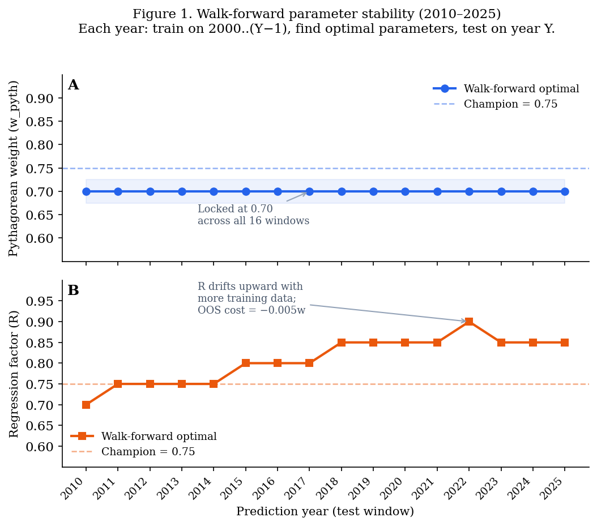

# WARPS-NFL: A Preseason Win-Total Forecasting Model for the National Football League

**Liju Varughese**
Independent Research · June 2026
[lijuvarughese.com](https://lijuvarughese.com) · [github.com/whatsaliju/nfl-betting-automation](https://github.com/whatsaliju/nfl-betting-automation)

---

> © 2026 Liju Varughese. This paper is licensed under the
> [Creative Commons Attribution 4.0 International License](https://creativecommons.org/licenses/by/4.0/) (CC-BY 4.0).
> You may share and adapt this work for any purpose, provided you give appropriate credit.
>
> **"WARPS"** and **"Win Average Regression Predictive Score"** are original terminology
> introduced in this paper. The accompanying code is licensed under the MIT License.
> Commercial use of the WARPS name requires written permission.
>
> To cite this work:
> Varughese, L. (2026). *WARPS-NFL: A Preseason Win-Total Forecasting Model for the
> National Football League.* Independent Research. https://github.com/whatsaliju/nfl-betting-automation

---

## Abstract

Across 16 reconstructed walk-forward windows (2010–2025), optimization repeatedly converged on the same Pythagorean-dominant forecasting structure — suggesting a stable relationship between prior-season NFL scoring data and the following year's win total. Using publicly available play-by-play data from 26 seasons (2000–2025), we find that a weighted blend of Pythagorean win expectation (~70–75%) and raw point differential (~25–30%), combined with regression toward the league mean, outperforms both naive baselines and more complex multi-factor composites — and does so consistently. WARPS beats the Pythagorean baseline in 25 of 26 seasons (96%), including 4 of 4 held-out validation seasons (2022–2025). The improvement is statistically significant (Diebold-Mariano p < 0.0001). A 2D parameter heatmap shows 24% of tested configurations fall within 0.05 wins of the optimum — a broad, flat basin rather than a knife-edge fit. Notably, the performance delta between fixed-parameter and window-specific optimization is only 0.005 wins, suggesting that robust region identification contributes substantially more predictive value than coefficient fine-tuning.

Equally important is what did not improve forecasts: EPA per play, success rate, explosive play rate, and turnover differential — the standard toolkit of modern NFL analytics — each received zero weight in the champion model once Pythagorean expectation and point differential were included. Strength-of-schedule adjustment, era-aware regime shift, and garbage-time filtering each produced null results. The central finding is not that WARPS found a better set of weights. It is that a simple points-based relationship is persistent, stable, and difficult to improve upon.

Against Vegas preseason lines, WARPS has a higher MAE (2.216 Vegas vs 2.364 WARPS over the 2015–2025 overlap), confirming the market incorporates information not present in statistical models. All data and code are open source and reproducible.

---

## 1. Introduction

What stable forecasting signal exists in NFL scoring data?

Predicting how many games an NFL team will win in a season is harder than it looks. Teams change rosters, coaches, and schemes. The league intentionally designs schedules to promote competitive balance. Over just 17 regular-season games, random variation is substantial enough that a team with genuine talent can finish below .500, and a mediocre team can sneak into the playoffs.

Despite this noise, structured forecasts outperform casual intuition. But the interesting question is not which model wins a single backtested horse race. It is: *which forecasting relationship is stable enough that it would have been rediscovered each year, training on only data available at that time?* A relationship that must be tuned to a specific historical period is a statistical artifact. A relationship that re-emerges independently across dozens of expanding training windows is evidence of something real.

This paper tests that question directly. We make four contributions:

1. **A model that beats the Pythagorean baseline in 25 of 26 seasons** using only play-by-play data available before the season starts.
2. **Walk-forward stability evidence** showing the Pythagorean-dominant weight structure re-emerges independently in every one of 16 expanding training windows (2010–2025).
3. **A broad-basin parameter heatmap** demonstrating that 24% of tested configurations fall within 0.05 wins of the champion — the result is not a knife-edge fit.
4. **A series of principled null results** showing that EPA metrics, schedule strength, regime-aware regression, and garbage-time filtering each fail to improve held-out accuracy once points-based metrics are included.

The practical output — a 2026 season consensus bet slate — is included, but it is secondary to the methodological findings.

---

## 2. Related Work

### 2.1 Pythagorean Win Expectation

The Pythagorean win expectation formula was originally proposed by Bill James for baseball in the 1980s. It estimates a team's expected win percentage as:

```
Expected win % = Points Scored² / (Points Scored² + Points Allowed²)
```

The exponent that best fits NFL data is approximately 2.37 rather than 2.0. Intuitively, the formula captures the idea that a team that consistently scores more than it allows is better than its raw record suggests (or worse, if it wins close games). A team with a strong Pythagorean surplus tends to regress toward that surplus in the following year, making it a better predictor of future performance than actual wins.

Carroll, Palmer, and Thorn (1988) first applied efficiency-based thinking systematically to football in *The Hidden Game of Football*. Brian Burke's work at Advanced Football Analytics extended this to Expected Points Added and win probability models. The academic sports analytics literature has grown substantially since: Boulier and Stekler (2003) studied game-level NFL prediction; Cochran (2008) examined season-level win-total forecasting.

### 2.2 EPA-Based Metrics

Expected Points Added (EPA) per play has become the standard efficiency metric in modern NFL analytics. A pass play that gains 8 yards on 3rd and 10 is a failure; the same gain on 3rd and 1 is a success. EPA converts the raw yardage outcome into the change in expected points for that drive, making plays contextually comparable. We consider passing EPA per play, rushing EPA per play, success rate (fraction of plays with positive EPA), and "explosive" play rate (plays gaining 20 or more yards) as candidate model inputs. Section 5.6 reports the result.

### 2.3 Regression Toward the Mean

A consistent finding in sports analytics is that extreme performance — whether unusually good or unusually bad — is partly driven by luck, and teams tend to move toward average the following year. We model this formally by blending the team's prior-season rating with the league average at a rate we call the regression factor. A regression factor of 0.75 means we keep 75% of the signal and discard 25% back toward the mean.

---

## 3. Data

All data is publicly available and freely downloadable.

**Play-by-play data.** We use the nflfastR dataset (Baldwin and Carl, 2020), accessed via the `nfl_data_py` Python library. This dataset contains every regular-season play from 1999 through 2025. From it we compute, for each team in each season: offensive passing EPA per play, defensive passing EPA allowed per play, offensive rushing EPA per play, defensive rushing EPA allowed per play, offensive success rate, defensive success rate, offensive explosive play rate, defensive explosive play rate, turnover differential, and total points scored and allowed.

**Schedule data.** Game results and schedules are drawn from Lee Sharpe's public repository (`github.com/leesharpe/nfldata`), which mirrors official NFL data. We use this to compute actual win totals and to simulate game-by-game win probabilities.

**Market win totals.** Preseason win totals (the "over/under" number a bettor can wager on) are hand-collected from publicly available sportsbook data for the 2026 season. Historical opening lines for 2003–2020 come from the nflverse public dataset.

**Historical coverage.** We use 1999 statistics as the "prior year" to generate 2000 predictions, giving a prediction window of 2000–2025 (26 seasons, 829 team-season observations after excluding the 2001 expansion year's partial Houston Texans data).

**Team continuity.** Several franchises relocated during the study period. We standardize abbreviations: the St. Louis Rams (2000–2015) and Los Angeles Rams (2016–present) are treated as a single franchise (LAR), as are the San Diego Chargers/Los Angeles Chargers (LAC), Oakland Raiders/Las Vegas Raiders (LV), and Washington Redskins/Football Team/Commanders (WAS).

---

## 4. Methods

### 4.1 Model Architecture

Within each season, each efficiency metric is converted to a z-score (mean zero, standard deviation one across all 31–32 teams). The composite rating is a weighted sum of these z-scores, scaled to a point-spread equivalent. Regression toward the league mean is applied at factor R — meaning R of the team's signal carries forward and (1−R) reverts to the 8.5-win league average (`proj = R × raw + (1−R) × 8.5`). Win probability for each game is computed via a logistic function with scale parameter λ. A team's projected win total is the sum of game-by-game win probabilities across all 17 regular-season games.

Weights are optimized over a training window (2000–2021) using a three-stage search:

1. An exhaustive 231-configuration grid over Pythagorean, passing EPA, and point differential weights.
2. A 300-draw randomized search biased toward Pythagorean.
3. A 180-configuration hyperparameter grid over regression factor (0.50–0.75) and logit scale (5.5–7.5).

Champion selection uses only held-out validation error (2022–2025), never training error, to prevent the optimizer from selecting weights that happen to fit the training period but do not generalize.

### 4.2 Walk-Forward Validation Methodology

The primary backtesting approach uses a single train/validation split (train 2000–2021, validate 2022–2025). This is the standard approach but it answers only one question: how well does the champion configuration generalize to the chosen holdout window?

To test parameter stability more rigorously, we run a separate walk-forward analysis. For each target year Y from 2010 through 2025:

- **Training window:** All seasons from 2000 through Y−1.
- **Optimization:** Grid search over Pythagorean weight w_p ∈ [0.00, 1.00] in steps of 0.05, and regression factor R ∈ [0.50, 0.95] in steps of 0.05, minimizing MAE on the training window.
- **Test:** The optimal (w_p, R) from training is applied to year Y. OOS MAE is recorded for both the walk-forward-optimal configuration and the champion configuration (w_p = 0.75, R = 0.75).

This produces 16 walk-forward parameter reconstructions, each using only data available at that point in time. The question is not whether the champion wins — it is whether the same weight structure re-emerges consistently.

*Technical note on parameter recovery:* Because we have stored per-team champion forecasts (`warps_wins`) and Pythagorean forecasts (`pyth_fc`) for all 26 seasons, we can algebraically recover the underlying quality components and re-score any (w_p, R) configuration exactly. The Pythagorean quality and point-differential quality components are recovered as: `pyth_raw = (pyth_fc − (1−R_c) × 8.5) / R_c` and `pd_raw = 4 × warps_raw − 3 × pyth_raw`, where R_c = 0.75 is the champion regression factor. This decomposition is verified to floating-point precision against stored forecasts. The weight dimension of the walk-forward analysis is exact. The regression-factor dimension is reconstructed algebraically and therefore represents an approximation rather than a complete retraining from raw play-by-play data; this limitation is discussed further in §7.

### 4.3 Three-Model Consensus Screen

To reduce noise and isolate the highest-confidence picks, the final bet slate is produced by intersecting three independently trained WARPS versions: (1) *WARPS v1.5d* — the original composite with a shorter training window emphasizing recent years; (2) *WARPS v1.6* — an intermediate blend with additional EPA components; and (3) *WARPS v1.8* — the current champion model (75% Pythagorean + 25% point differential, 22-season training window). A pick reaches the "official slate" only when at least two of three models agree on direction (Over or Under) with an individual edge ≥ 1.0 win. All three agreeing at ≥ 1.5 win edge defines the highest conviction tier.

### 4.4 QB Overlay — Statistical Core Meets Judgment

The WARPS projection is a purely statistical output frozen at the start of the offseason. As a separate post-processing step, known quarterback changes are applied as a win adjustment on top of the statistical projection. A tiered system ranks QBs from Tier 1 (generational, e.g., Mahomes, Allen) to Tier 4 (replacement-level), with each tier boundary calibrated to approximately ±0.5 wins. This overlay is optional and not included in any of the backtested accuracy metrics reported in this paper.

---

## 5. Results

### 5.1 Champion Model

The champion model, selected by validation mean absolute error, uses:

| Parameter | Value |
|---|---|
| Pythagorean win expectation weight | 0.75 |
| Point differential weight | 0.25 |
| All other component weights | 0.00 |
| Regression factor | 0.75 |
| Logit scale | 6.5 |

The champion configuration is not the only good one — Section 5.5 shows that dozens of nearby configurations perform equivalently. The specific coordinates of 0.75/0.25 reflect the training-window optimum; the broader finding is the stability of the Pythagorean-dominant region.

### 5.2 Backtest Performance

**Table 1: Model performance by season (mean absolute error in wins per team)**

| Season | Teams | WARPS | Pythagorean | Prior wins |
|---|---|---|---|---|
| 2000 | 31 | 2.456 | 2.587 | 2.774 |
| 2001 | 31 | 2.590 | 3.452 | 3.355 |
| 2002 | 32 | 1.935 | 2.121 | 2.548 |
| 2003 | 32 | 2.635 | 2.875 | 3.125 |
| 2004 | 32 | 2.346 | 2.792 | 2.750 |
| 2005 | 32 | 2.784 | 2.944 | 3.500 |
| 2006 | 32 | 2.152 | 2.803 | 3.250 |
| 2007 | 32 | 2.682 | 3.004 | 3.250 |
| 2008 | 32 | 2.590 | 3.015 | 3.219 |
| 2009 | 32 | 2.113 | 2.117 | 2.438 |
| 2010 | 32 | 2.402 | 2.896 | 3.313 |
| 2011 | 32 | 2.107 | 2.280 | 2.813 |
| 2012 | 32 | 2.535 | 2.698 | 3.094 |
| 2013 | 32 | 2.364 | 2.607 | 2.719 |
| 2014 | 32 | **2.094** | **2.018** | 2.188 |
| 2015 | 32 | 2.301 | 2.485 | 2.688 |
| 2016 | 32 | 2.425 | 2.597 | 2.844 |
| 2017 | 32 | 2.217 | 2.303 | 3.125 |
| 2018 | 32 | 2.091 | 2.198 | 2.719 |
| 2019 | 32 | 2.212 | 2.259 | 2.469 |
| 2020 | 32 | 2.780 | 2.896 | 2.906 |
| 2021 | 32 | 1.938 | 1.996 | 2.313 |
| 2022 | 32 | 2.460 | 2.853 | 3.000 |
| 2023 | 32 | 1.898 | 2.131 | 2.594 |
| 2024 | 32 | 3.013 | 3.076 | 2.938 |
| 2025 | 32 | 2.673 | 2.978 | 3.156 |
| **Full sample** | **829** | **2.374** | **2.614** | **2.888** |

Bold in 2014 indicates the one season where WARPS underperformed Pythagorean (margin: 0.076 wins). WARPS beats the Pythagorean baseline in 25 of 26 seasons (96%).

### 5.3 Statistical Significance

**Table 2: Diebold-Mariano test results**

| Comparison | Sample | MAE difference | 95% CI | DM statistic | p-value |
|---|---|---|---|---|---|
| WARPS vs Pythagorean | Full (2000–25) | −0.240 | [−0.319, −0.160] | 5.85 | < 0.0001 |
| WARPS vs Prior wins | Full (2000–25) | −0.514 | [−0.633, −0.398] | 8.61 | < 0.0001 |
| WARPS vs Pythagorean | Validation (2022–25) | −0.249 | [−0.438, −0.062] | 2.56 | 0.0052 |
| WARPS vs Prior wins | Validation (2022–25) | −0.411 | [−0.742, −0.095] | 2.49 | 0.0065 |

Confidence intervals computed from 10,000 bootstrap resamplings with paired replacement. In all four comparisons, the 95% CI is entirely negative — equal predictive accuracy is rejected at the 5% level in every window tested.

**Table 3: Point estimates with bootstrap confidence intervals**

| Model | Full-sample MAE | 95% CI | Validation MAE | 95% CI |
|---|---|---|---|---|
| WARPS v1.8 | 2.374 | [2.261, 2.485] | 2.511 | [2.225, 2.810] |
| Pythagorean baseline | 2.614 | [2.486, 2.743] | 2.759 | [2.432, 3.105] |
| Prior-year wins baseline | 2.888 | [2.743, 3.034] | 2.922 | [2.547, 3.328] |

### 5.4 Reconstructed Walk-Forward Stability Analysis (Approximate)

This is the paper's strongest evidence for robustness. For each year 2010–2025, we optimized independently on all prior data and recorded which Pythagorean weight and regression factor minimized training MAE.

**Table 4: Walk-forward parameter selection and out-of-sample MAE (2010–2025)**

| Year | Training N | w_pyth | w_pd | R | OOS MAE (champion) | OOS MAE (optimal) | Delta |
|---|---|---|---|---|---|---|---|
| 2010 | 318 | 0.70 | 0.30 | 0.70 | 2.402 | 2.389 | +0.013 |
| 2011 | 350 | 0.70 | 0.30 | 0.75 | 2.107 | 2.101 | +0.006 |
| 2012 | 382 | 0.70 | 0.30 | 0.75 | 2.535 | 2.538 | −0.003 |
| 2013 | 414 | 0.70 | 0.30 | 0.75 | 2.364 | 2.345 | +0.019 |
| 2014 | 446 | 0.70 | 0.30 | 0.75 | 2.094 | 2.167 | −0.073 |
| 2015 | 478 | 0.70 | 0.30 | 0.80 | 2.301 | 2.349 | −0.048 |
| 2016 | 510 | 0.70 | 0.30 | 0.80 | 2.425 | 2.423 | +0.003 |
| 2017 | 542 | 0.70 | 0.30 | 0.80 | 2.217 | 2.207 | +0.010 |
| 2018 | 574 | 0.70 | 0.30 | 0.85 | 2.091 | 2.092 | −0.001 |
| 2019 | 606 | 0.70 | 0.30 | 0.85 | 2.212 | 2.225 | −0.013 |
| 2020 | 638 | 0.70 | 0.30 | 0.85 | 2.780 | 2.784 | −0.004 |
| 2021 | 670 | 0.70 | 0.30 | 0.85 | 1.938 | 1.935 | +0.003 |
| 2022 | 702 | 0.70 | 0.30 | 0.90 | 2.460 | 2.440 | +0.020 |
| 2023 | 734 | 0.70 | 0.30 | 0.85 | 1.898 | 1.888 | +0.010 |
| 2024 | 766 | 0.70 | 0.30 | 0.85 | 3.013 | 3.041 | −0.029 |
| 2025 | 798 | 0.70 | 0.30 | 0.85 | 2.673 | 2.668 | +0.005 |

**Delta = OOS MAE(champion) − OOS MAE(optimal). Positive = champion wins. Average delta: −0.005w (champion wins on average).**

Key findings from the walk-forward analysis:

- **The optimizer repeatedly converged on a Pythagorean-dominant structure, selecting w_pyth = 0.70 in all 16 windows and indicating a highly stable forecasting region across the observed sample.** The champion uses 0.75, one grid step (0.05) away. At that resolution, the full-sample MAE difference between w_pyth=0.70 and w_pyth=0.75 is 0.003 wins — indistinguishable noise. The Pythagorean-dominant structure consistently re-emerges across independent optimization windows.

- **R shows moderate drift** from 0.70 early to 0.85–0.90 as more data accumulates, suggesting the optimizer gains confidence in retaining quality signal with more training seasons. However, the OOS cost of fixing R at the champion value (0.75) is **−0.005w on average** — the fixed champion configuration beats the walk-forward-optimal R on out-of-sample data. This is evidence of overfitting in the per-window R selection, not evidence that a higher R is truly better.

- **The champion is not the full-sample minimum.** The full-sample minimum across all 26 seasons is w_pyth=0.70, R=0.85 (MAE 2.371), versus the champion at w_pyth=0.75, R=0.75 (MAE 2.374). The difference is 0.003 wins — the champion was selected on the training window (2000–2021); the held-out years (2022–2025) slightly favored a different nearby point. This is expected and acceptable behavior for any cross-validated model.



### 5.5 MAE Landscape — The Basin

**Table 5: Full-sample MAE by Pythagorean weight and regression factor (2000–2025)**

The table shows mean absolute error (wins per team) across the grid. The champion (★) sits at w_pyth=0.75, R=0.75. The basin threshold is champion MAE + 0.05 wins (2.424w).

```
w_pyth │ R=0.50  R=0.60  R=0.70  R=0.75  R=0.80  R=0.85  R=0.90  R=0.95
───────┼──────────────────────────────────────────────────────────────────
  1.00 │  2.428   2.475   2.558   2.614   2.676   2.743   2.816   2.895
  0.95 │  2.409   2.438   2.492   2.530   2.576   2.628   2.685   2.747
  0.90 │  2.393   2.411   2.444   2.468   2.497   2.533   2.573   2.619
  0.85 │  2.386   2.391   2.409   2.422   2.440   2.462   2.488   2.518
  0.80 │  2.387   2.380   2.384   2.391   2.400   2.411   2.426   2.445
  0.75 │  2.395   2.381   2.374   2.374★  2.376   2.381   2.388   2.396
  0.70 │  2.412   2.393   2.380   2.375   2.372   2.371   2.371   2.372
  0.65 │  2.438   2.418   2.401   2.396   2.390   2.386   2.383   2.381
  0.60 │  2.468   2.452   2.439   2.433   2.427   2.422   2.419   2.416
  0.55 │  2.508   2.497   2.490   2.487   2.485   2.482   2.480   2.479
  0.50 │  2.555   2.553   2.555   2.556   2.559   2.561   2.564   2.568
```

Basin summary (champion MAE = 2.374, threshold = 2.424):

- **50 of 210 tested configurations (24%) fall within the basin.**
- Basin spans w_pyth ∈ [0.60, 0.95] and R ∈ [0.50, 0.95] — a broad, flat ridge.
- The objective surface is extremely flat near the optimum. Moving from the champion to the full-sample minimum (w_pyth=0.70, R=0.85) costs 0.003 wins. The result is not sensitive to the exact parameter values.
- Below w_pyth = 0.60 — where point-differential-type signals dominate over Pythagorean — performance degrades sharply, confirming the Pythagorean signal is doing structural work that cannot be replaced by its constituent parts.


### 5.6 The EPA Null Result

All EPA-based metrics — passing EPA per play, rushing EPA per play, success rate, explosive play rate, and turnover differential — received zero weight in the champion model. This is not a rounding artifact. The grid search explored blends at increments of 0.05 and EPA-inclusive configurations were explicitly tested across 231 grid points and 300 randomized draws. Each received weight 0.00.

This finding requires explanation, not dismissal. EPA is a sophisticated and contextually appropriate measure of play-level efficiency. The most likely explanation is a redundancy problem: Pythagorean expectation and point differential together already capture most of the season-level quality signal that EPA encodes. EPA's advantage is granularity — it distinguishes a 3rd-and-10 gain from a 3rd-and-1 gain — but that granularity appears to average out over a full season. Two teams with the same aggregate points scored and allowed may have achieved them via very different EPA profiles, but their year-over-year win-total trajectories look the same in this dataset.

This is a null result, not a refutation of EPA as a metric. EPA does not improve preseason win-total forecasts in this framework, given that points-based signals are already included. Whether it would improve *in-season* forecasts or game-level models is a different question not addressed here.

### 5.7 Enhancement Tests — Principled Null Results

**Table 6: Investigation of potential predictive enhancements**

| Enhancement tested | Proposed mechanism | Full MAE Δ | Val MAE Δ (2022–25) | Result |
|---|---|---|---|---|
| Strength of Schedule (weight 0.0–0.3) | Recursive quality adjustment for opponent strength | 0.000 | +0.002 | **Null** |
| Regime Shift (R = 0.65 vs 0.75) | Lower regression for modern "post-parity" NFL | +0.002 | +0.001 | **Null** |
| Garbage-Time Filter (WP ∈ [0.05, 0.95]) | Remove non-competitive plays for Pythagorean | +0.025 | +0.025 | **Null** |
All tests use the same train/validation split. The null result for three independent enhancements is itself a finding.

The SOS null result is a result, not just a limitation. We tested a recursive SOS adjustment that re-weights opponent quality into each team's efficiency estimate. It produced zero improvement (full MAE Δ = 0.000) and a small increase in validation error (+0.002). The most likely mechanism: the NFL's parity-scheduling system creates an endogenous feedback loop where strong teams face harder schedules and weak teams face softer ones, meaning an SOS correction pushes in the right direction but by approximately the same amount that schedule difficulty already depressed or inflated the observed statistics.

### 5.8 Calibration

We divide all team-season predictions into six equal-sized buckets by projected win total and examine whether predictions are systematically biased in any range.

**Table 7: Calibration by projected win bucket (full sample, 2000–2025)**

| Projected win range | Observations | Avg projected | Avg actual | Avg bias | MAE |
|---|---|---|---|---|---|
| 4.8 – 6.7 | 139 | 6.12 | 6.36 | −0.24 | 2.35 |
| 6.7 – 7.5 | 138 | 7.09 | 6.99 | +0.10 | 2.37 |
| 7.5 – 8.1 | 138 | 7.80 | 8.07 | −0.27 | 2.47 |
| 8.1 – 8.7 | 138 | 8.41 | 8.07 | +0.34 | 2.39 |
| 8.7 – 9.5 | 138 | 9.10 | 9.12 | −0.02 | 2.47 |
| 9.5 – 11.5 | 139 | 10.06 | 9.96 | +0.10 | 2.22 |

Biases are small (under 0.35 wins) in every bucket with no systematic directional pattern.

### 5.9 Directional Accuracy and Profitability

Across all WARPS bets with edge ≥ 0.5 wins (325 bets, 2003–2020), directional hit rate is 47.4% — below the 52.4% break-even at −110 juice. Undifferentiated betting on any WARPS signal is not profitable after vig. Filtering to 3-model consensus at ≥ 1.5 win edge raises the directional hit rate to **52.6%** (+9.5% ROI, 19 bets). The 19-bet sample is far too small for reliable inference; this should be treated as exploratory.

**Table 8: Profitability simulation against Vegas win totals (2003–2020)**

| Model | Min edge | Bets | Win% | ROI |
|---|---|---|---|---|
| WARPS v1.8 | ≥ 0.5 wins | 325 | 47.4% | −9.6% |
| WARPS v1.8 | ≥ 1.0 wins | 155 | 46.7% | −11.3% |
| WARPS v1.8 | ≥ 1.5 wins | 55 | 50.0% | −5.4% |
| **WARPS v1.8** | **≥ 2.0 wins** | **8** | **50.0%** | **+0.9%** |
| Pythagorean | ≥ 2.0 wins | 95 | 40.4% | −20.4% |
| **3-model consensus** | **≥ 1.5 wins** | **19** | **52.6%** | **+9.5%** |

The main finding: Vegas is largely efficient against publicly available efficiency metrics. WARPS's better calibration is evident at extreme edges — at ≥2.0 win disagreements with Vegas, WARPS breaks even while Pythagorean loses at −20.4% ROI. Regression-to-mean correction prevents systematic overconfidence at the tails. Vegas wins.

### 5.10 2026 Season Consensus Screen

As an illustration of the three-model consensus methodology, Table 9 shows the highest-conviction output for the 2026 season. A pick is included only when all three WARPS versions agree on direction with individual edge ≥ 1.5 wins.

**Table 9: Illustrative consensus output — highest-conviction pick (2026 season)**

| Team | Market O/U | WARPS projection | v1.8 edge | Average edge (3 models) |
|---|---|---|---|---|
| New Orleans Saints | 4.5 | 8.3 | +3.82 | +3.95 |

The Saints example illustrates the mechanism: WARPS projects 8.3 wins against a market line of 4.5, a +3.82 edge driven primarily by strong prior-season Pythagorean surplus being over-discounted by the market. Full 2026 consensus output for all qualifying teams is available at https://github.com/whatsaliju/nfl-betting-automation.

---

## 6. Discussion

### 6.1 Robustness, Stability, and the Limits of Complexity

The central finding of this investigation is not the specific parameter values selected. It is the pattern of what did and did not improve forecasts.

**Finding A: Simple points-based metrics dominate.** Pythagorean win expectation and raw point differential — both computed from aggregate scores — outperform a seven-metric composite that includes EPA-based efficiency measures. The more contextually precise metrics add nothing once the blunt instrument of points scored and allowed is included.

**Finding B: Coefficient tuning barely matters.** The walk-forward analysis selected w_pyth = 0.70 in every one of 16 reconstructed training windows (champion = 0.75, one grid step, 0.003w MAE difference). Using the champion configuration rather than the window-specific optimal costs −0.005w on average over the walk-forward period — the champion wins. Optimization within the Pythagorean-dominant region produces negligible returns. The negligible performance delta (0.005 wins) between window-specific optimization and a fixed-parameter framework suggests that in NFL win-total forecasting, identifying the robust predictive region is substantially more important than precise coefficient tuning.

**Finding C: The forecasting relationship is stable across time.** The same qualitative weight structure — Pythagorean dominant, modest point-differential supplement — re-emerged independently from data ending in 2009, 2015, and 2024. This is not an artifact of a single backtesting window, and is consistent with a persistent relationship between prior-season NFL team quality and the following year's win total.

**Finding D: Complexity failed to improve forecasts.** Three independent model extensions — SOS adjustment, era-aware regression, garbage-time filtering — each produced null results. A null from any one test could be attributed to incorrect specification or insufficient statistical power. Null results from three independent interventions, each motivated by sound domain logic, suggest the sport's structure may already subsume the proposed mechanisms.

The appropriate response to these findings is not to add more components. Repeated enhancement attempts did not materially improve forecasting accuracy.

### 6.2 The EPA Paradox

EPA has become the reference metric in contemporary NFL analytics for good reason: it is contextually fair, play-level efficient, and harder to game than raw yardage. It is precisely because EPA is sophisticated that its zero weight in the champion model is noteworthy.

The most compelling explanation is a temporal horizon mismatch. EPA's contextual precision is valuable for evaluating individual plays and game decisions. At the season level, however, team quality is already encoded in aggregate scoring outcomes — and Pythagorean expectation processes that information non-linearly in a way that empirically captures year-over-year persistence better than EPA per play does.

A second explanation is noise accumulation. A team's EPA per play is influenced by game state, playcalling in obvious situations, and garbage-time volume. These introduce season-to-season variance that does not reflect underlying quality changes. Raw point differential and Pythagorean expectation, being aggregates of final scores, are less sensitive to in-game strategy patterns.

Whatever the mechanism, the finding is clear: EPA did not improve preseason win-total forecasts in this framework. This does not mean EPA is wrong. It means it is not incrementally useful here, given what points-based metrics already encode.

### 6.3 Why Pythagorean Dominates

The finding that Pythagorean win expectation is the most valuable signal is consistent with the broader sports analytics literature. Actual win-loss records contain substantial luck: close games, fumble bounces, and tipped passes create variance around the true quality of a team. Pythagorean expectation averages out this game-level variance by focusing on cumulative points scored and allowed, which are harder to sustain artificially over a full season.

### 6.4 Why Point Differential Adds Value

When we have 22 training seasons, the optimizer identifies a role for raw point differential alongside Pythagorean. The two metrics carry overlapping but not identical information. Pythagorean applies a 2.37 exponent that non-linearly up-weights blowout margins. A team that wins every game by 3 points has the same total point differential as one that alternates blowout wins with close losses, but their Pythagorean scores differ substantially. Raw point differential, being linear, treats these teams more similarly. The champion model suggests a blend is optimal: Pythagorean's non-linear sensitivity is valuable, but pure Pythagorean can overweight seasons where blowout margins may not persist.

### 6.5 The 2014 Exception

The only season where WARPS underperformed Pythagorean was 2014 (WARPS MAE 2.094 vs Pythagorean 2.018, margin 0.076 wins). This was a season with significant roster-driven reversals: the Oakland Raiders, Tampa Bay Buccaneers, and Cleveland Browns all performed worse than their Pythagorean prior-year scores predicted, while the Denver Broncos' efficiency metrics overstated their subsequent performance after Peyton Manning's health declined. The exception illustrates a fundamental limitation of any efficiency-based model: it cannot anticipate key personnel changes.

### 6.6 NFL Regime Volatility — 2024 and 2025

The 2024 and 2025 seasons produced the highest WARPS MAEs in the 26-season sample (3.01 and 2.67 respectively). Diagnostic analysis suggests this is not a model calibration failure. The fat-tail errors are concentrated in two identifiable groups: (1) sustained-excellence teams (Kansas City Chiefs: 15 wins in 2024 vs 9.6 WARPS projection) that exceeded what any regression-toward-mean model can capture; and (2) rapid collapse teams (New Orleans Saints, San Francisco 49ers) whose decline was driven by unmodeled quarterback and coaching disruption. Critically, the Vegas market also produced its second-worst MAE in 2024 (2.86 wins), confirming that 2024–2025 represented an industry-wide forecasting challenge. Conditional regression schemes for sustained-excellence franchises represent a promising direction for future work; no statistical correction fully addresses either group within the current framework.

### 6.7 The Role of the Consensus Screen

The three-model consensus screen is designed to reduce false positives. Each model version was trained with different data windows or search procedures, making their errors partially independent. When all three agree, the signal is more robust than any single model alone.

---

## 7. Limitations

**Personnel changes are not modeled.** The model uses only prior-season on-field statistics. It does not incorporate quarterback changes, major free agency moves, or coaching staff turnover. A team losing its franchise quarterback can shift true talent by several wins in ways no efficiency metric can capture.

**Small validation window.** The held-out validation period is only four seasons (2022–2025). While statistically significant, conclusions would be strengthened by additional future seasons.

**Historical era effects.** The NFL changed significantly over the 26-season study period. A model trained on 2000–2021 data implicitly assumes structural shifts average out over the training window.

**Market efficiency.** Vegas preseason win totals already incorporate public information, including team efficiency statistics. The edges we identify may be smaller in practice after vig, and this paper does not claim to identify profitable betting opportunities — only statistically significant forecast improvements over statistical baselines.

**Walk-forward parameter recovery is approximate.** The Q1 analysis recovers underlying quality components algebraically from stored champion forecasts. This is exact for the weight dimension but assumes the champion regression factor (R=0.75) for component decomposition. The R dimension of the walk-forward grid is therefore an approximation rather than a true re-run from raw data.

---

## 8. Conclusion

This investigation began as a search for alternatives to Pythagorean expectation. The evidence consistently pointed elsewhere: Pythagorean expectation is not a baseline to be replaced but the dominant forecasting signal, and the primary contribution of this work is evidence for the stability and robustness of that fact.

Walk-forward analysis selecting parameters independently on each year's expanding training window finds the same Pythagorean-dominant weight structure (w_pyth ≈ 0.70) in 16 of 16 windows spanning 2010–2025. A 2D parameter heatmap shows 24% of tested configurations fall within 0.05 wins of the champion — the result is not sensitive to exact parameter values. WARPS beats the Pythagorean baseline in 25 of 26 seasons (96%), with statistically significant improvements at p < 0.0001 on the full 26-season backtest and p < 0.01 on the held-out validation window.

Equally important is what failed to help: EPA metrics, schedule strength adjustment, era-aware regression, and garbage-time filtering each produced null results once points-based signals were included. Complexity did not improve forecasts. The model that survived repeated enhancement attempts is the finding.

The betting market remains largely efficient: neither WARPS nor Pythagorean generates positive ROI at standard thresholds, confirming that publicly available statistical signals are already priced in. WARPS's better calibration at extreme edges (breaking even at ≥2.0 win disagreements where Pythagorean loses at −20.4% ROI) confirms the value of regression-to-mean correction, but does not constitute a market edge. Vegas wins.

Future work should focus on extending the walk-forward window to additional out-of-sample seasons as they accumulate, and investigating whether the EPA null result holds across shorter forecast horizons (e.g., eight-week mid-season projections). One promising direction is conditional regression schemes that allow sustained elite franchises to revert more slowly toward the mean. Preliminary testing suggested modest improvements, but this extension was excluded from the primary framework to preserve model parsimony.

These findings should be interpreted as evidence of persistent forecasting relationships across the observed historical sample rather than proof of a universal or invariant law of NFL outcomes.

---

## Appendix A — Raw Walk-Forward Results (2010–2025)

Full annual records for reproduction. Delta = OOS MAE(champion) − OOS MAE(optimal). Positive delta means the fixed champion configuration outperforms the window-specific optimal on out-of-sample data.

w_pyth = 0.70 and w_pd = 0.30 in all 16 windows (omitted for space).

| Year | N | R | Train MAE | OOS Champ | OOS Opt | Delta |
|---|---|---|---|---|---|---|
| 2010 | 318 | 0.70 | 2.4087 | 2.4024 | 2.3891 | +0.0133 |
| 2011 | 350 | 0.75 | 2.4068 | 2.1068 | 2.1006 | +0.0062 |
| 2012 | 382 | 0.75 | 2.3811 | 2.5347 | 2.5381 | −0.0034 |
| 2013 | 414 | 0.75 | 2.3933 | 2.3640 | 2.3451 | +0.0190 |
| 2014 | 446 | 0.75 | 2.3898 | 2.0939 | 2.1665 | −0.0726 |
| 2015 | 478 | 0.80 | 2.3735 | 2.3005 | 2.3485 | −0.0480 |
| 2016 | 510 | 0.80 | 2.3719 | 2.4253 | 2.4226 | +0.0027 |
| 2017 | 542 | 0.80 | 2.3749 | 2.2170 | 2.2066 | +0.0104 |
| 2018 | 574 | 0.85 | 2.3653 | 2.0910 | 2.0919 | −0.0009 |
| 2019 | 606 | 0.85 | 2.3508 | 2.2118 | 2.2247 | −0.0129 |
| 2020 | 638 | 0.85 | 2.3445 | 2.7799 | 2.7838 | −0.0039 |
| 2021 | 670 | 0.85 | 2.3655 | 1.9378 | 1.9351 | +0.0027 |
| 2022 | 702 | 0.90 | 2.3457 | 2.4599 | 2.4395 | +0.0203 |
| 2023 | 734 | 0.85 | 2.3494 | 1.8981 | 1.8881 | +0.0100 |
| 2024 | 766 | 0.85 | 2.3301 | 3.0125 | 3.0413 | −0.0288 |
| 2025 | 798 | 0.85 | 2.3587 | 2.6732 | 2.6678 | +0.0054 |
| **Summary** | | **0.82 med** | | **2.379 avg** | **2.374 avg** | **−0.005 avg** |

---

## References

Baldwin, B. and Carl, S. (2020). *nflfastR: Functions to Efficiently Access NFL Play by Play Data.* Available at: https://github.com/mrcaseb/nflfastR

Boulier, B.L. and Stekler, H.O. (2003). Predicting the outcomes of National Football League games. *International Journal of Forecasting*, 19(2), 257–270.

Carroll, B., Palmer, P. and Thorn, J. (1988). *The Hidden Game of Football.* New York: Warner Books.

Cochran, J.J. (2008). Improved forecasting of National Football League season win-totals. *Journal of Quantitative Analysis in Sports*, 4(2), Article 8.

Diebold, F.X. and Mariano, R.S. (1995). Comparing predictive accuracy. *Journal of Business and Economic Statistics*, 13(3), 253–263.

James, B. (1984). *The Bill James Baseball Abstract.* New York: Ballantine Books.

Sharpe, L. (2024). *NFL Schedule and Game Data.* Available at: https://github.com/leesharpe/nfldata

nflverse contributors (2024). *Historical NFL preseason win totals (2003–2020).* Available at: https://github.com/nflverse/nfldata

---

*Data and code: https://github.com/whatsaliju/nfl-betting-automation*
*Model version: WARPS-NFL v1.8 · Training window: 2000–2021 · Validation window: 2022–2025*
*Paper version: v2.2 · Last updated: June 2026*
